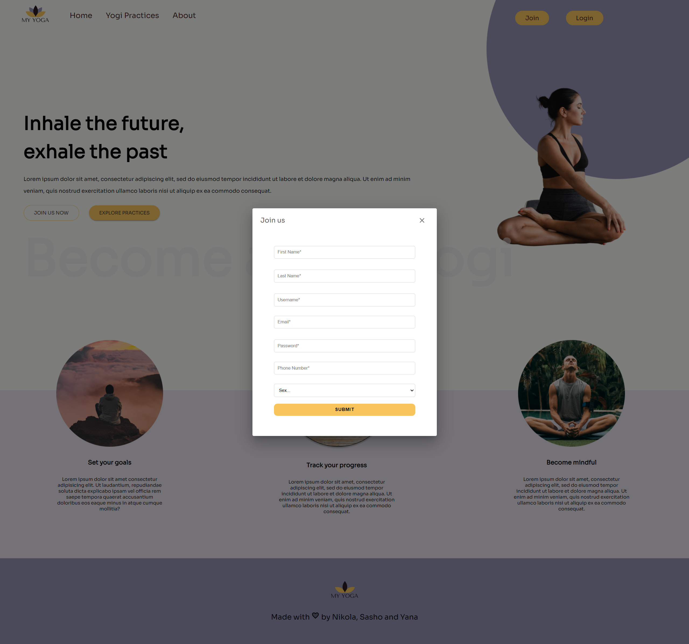
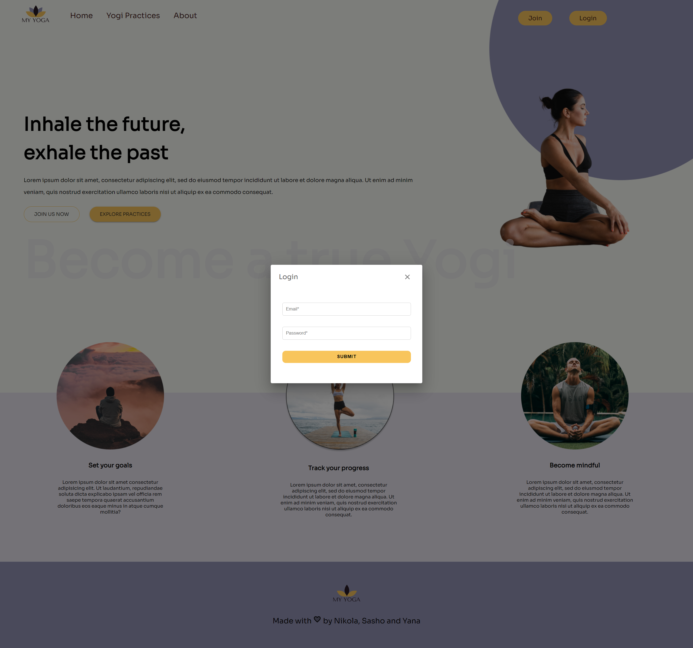
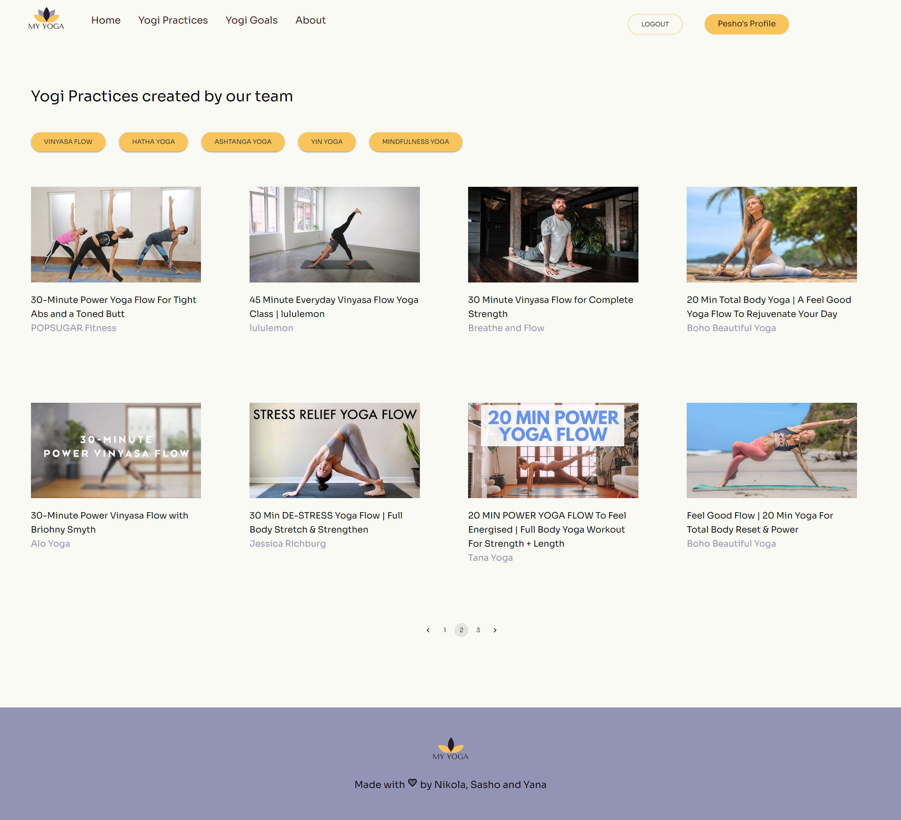
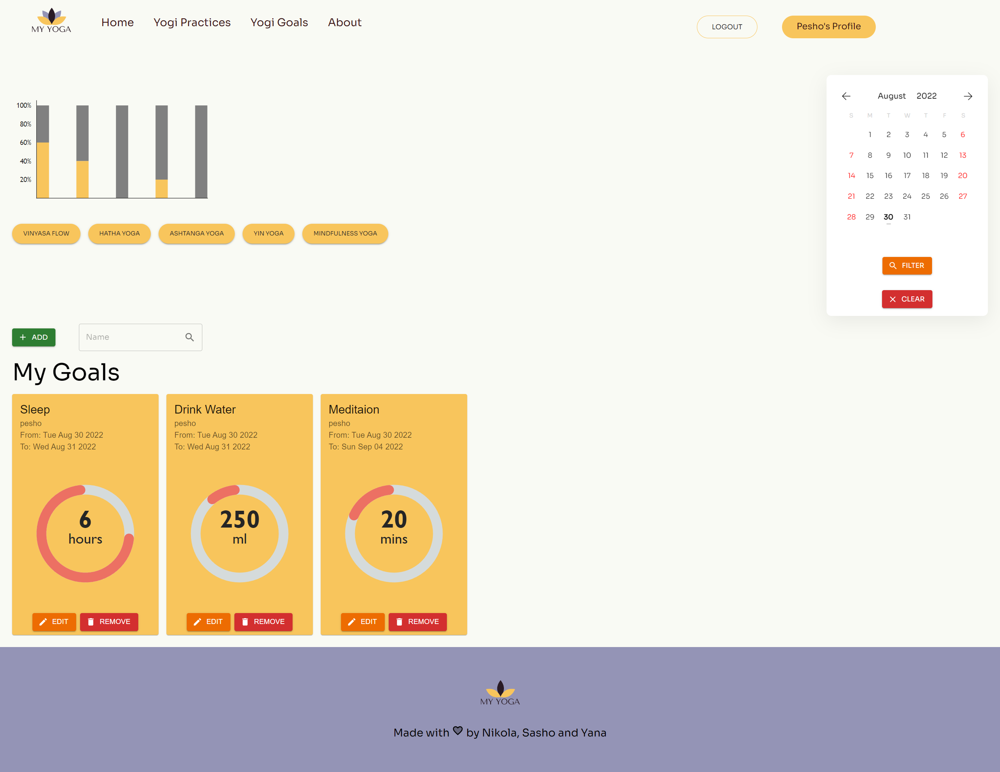
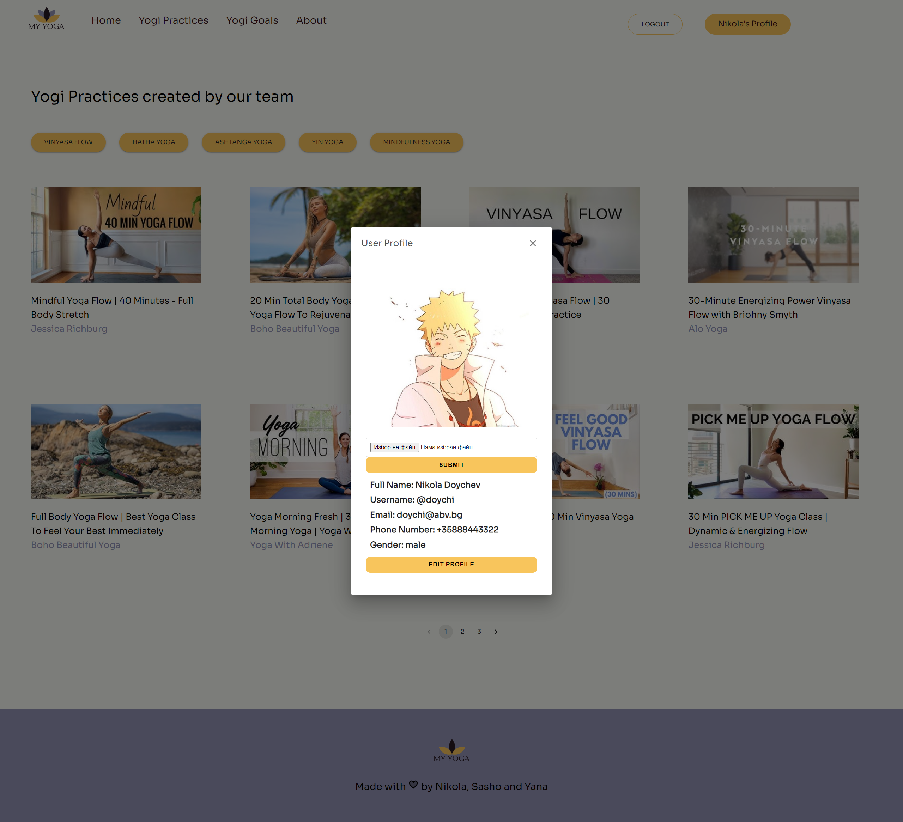
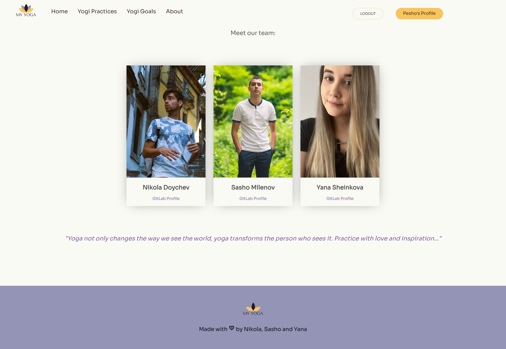

# MyYoga Tracking app


## Project Description

  - **MyYoga** is a single page application where you can get to know more about yoga, get access to various yoga videos, track your progress and become a true Yogi. Out of the box, the application provides you with the ability to access "Yogi Practices" page. There you can find 5 different styles of yoga practice videos, and get to know the Yogi world. The application also lets you register and get access to the "Yogi Goals" section. There you can track personal progress for one or more of the five yoga styles. You can also add, edit and remove  goals, filter the goals using a calendar and more!

  - There are a few dependencies you need to run - `react`, `firebase`, `react-toastify`, etc. To install the dependencies and be able to run the project, just run the following commands in cmd:

    ```
    npm i
    npm start
    ```
  - We are also using Google Firebase Hosting service. You can check our project by using the following link: https://fitness-tracker-app-f7bc9.web.app/

## List of features:

  - **Home Page** - Provides you with information about the app purposes as well as option to join the community or check the "Yogi Practices" and/or "Yogi Goals" pages.

  - **Register** - Let's you register and gives you access to "Yogi Goals" page.

  - **Login** - You can use this form to go through authentication and access your profile.

  - **Yogi Practices** - Provides you with access to yoga videos. You can choose between 5 yoga styles - Vinyasa Flow, Hatha, Ashtanga, Yin or Mindfulness yoga. You can change what videos to be presented with a click of a button. There are 3 pages of videos, that will be loaded for each of the selected yoga styles. When you click on a video, a new tab will open in the browser and the video will start.

  - **Yogi Goals** - Gives you the opportunity to track individual yoga progress and add goals. You can choose between 5 yoga styles and add/edit progress for each. You can also add/edit/remove different kind of goals and track progress for each as well. You can filter goals with the use of the calendar. There is also the opportunity to search for goals, access goals set by other users and add these to your dashboard.

  - **Profile** - Lets you upload a profile image and access basic information about your profile, such as username, email, phone number, etc. You can also edit your profile information with a click of a button.

  - **About** -  Provides information about the creators of the app.

## Tech Stack:

The project is written in:

- HTML5
- CSS3
- React JavaScript v18.0

We also used the following libraries and packets:

- Google Firebase Platform - App development platform. Used for backend purposes - authentication, realtime database, storage solutions.

- Material UI - Intuitive React UI tools

- Victory - React.js components for modular charting and data visualization.

- React Toastify - Add notifications to your app with ease.

- React-loader-spinner - Spinner component which can be implemented for async await operation before data loads to the view.

- Other - More about the project dependencies you can find in the package.json file

--- 


## App views

  - ### Home View

  

  - ### Register View

  

  - ### Login View

  


  - ### Yogi Practices View

  

  - ### Yogi Goals View

  

  - ### Profile View

  

  - ### About View

  


## Authors and Acknowledgment
  - Nikola Doychev - https://gitlab.com/doychikun

  - Sasho Milenov - https://gitlab.com/sasashi33

  - Yana Sheinkova - https://gitlab.com/YanaSheinkova
